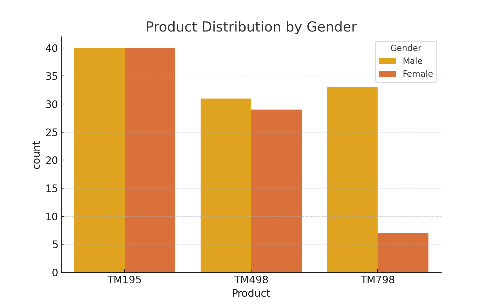
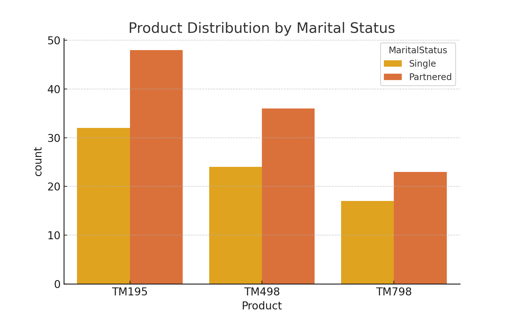
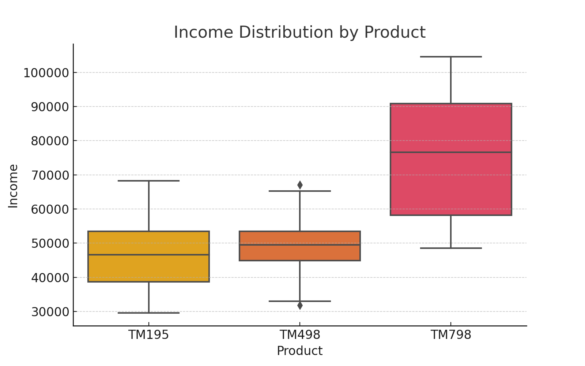
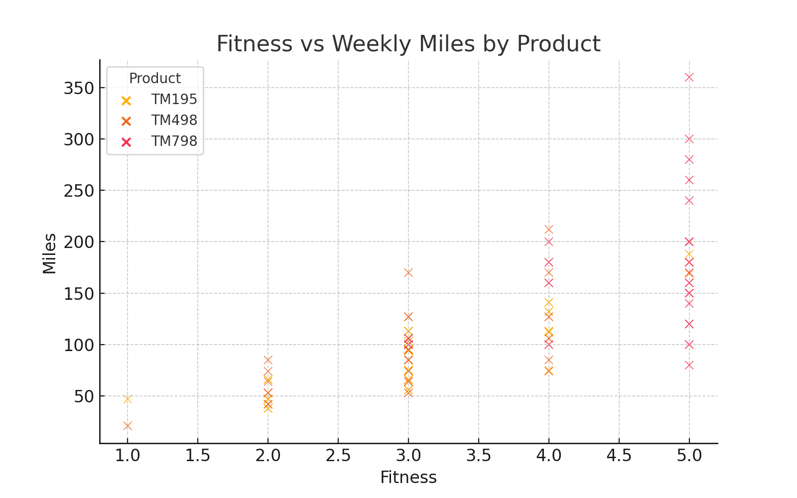
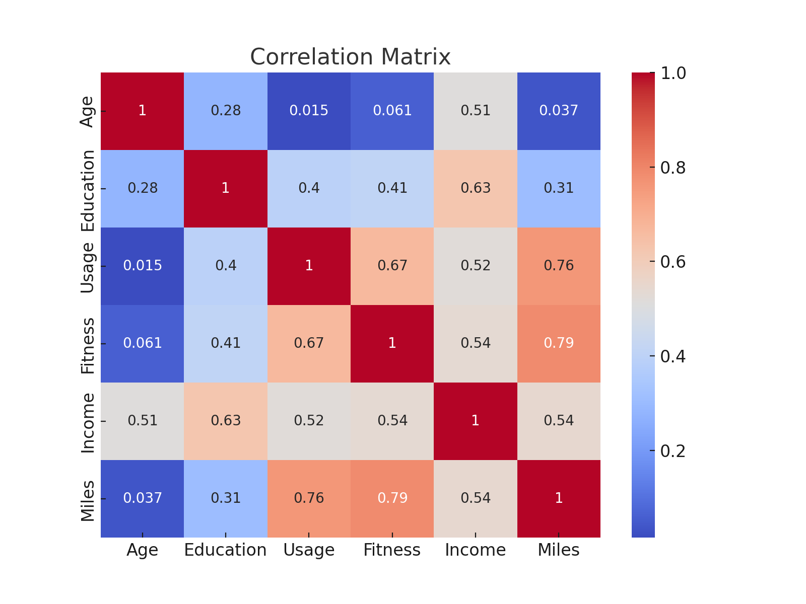

# 🏃 CardioGood Fitness Customer Analysis (Python)

This project explores customer profiles and usage patterns for different treadmill products offered by CardioGood Fitness. The analysis uses descriptive statistics to uncover relationships between demographics, product type, fitness level, and exercise habits.

---

## 📊 Dataset Overview

The dataset contains 180 entries and 9 columns:
- `Product`: Model purchased (TM195, TM498, or TM798)
- `Age`: Age of the customer
- `Gender`: Male/Female
- `Education`: Years of education
- `MaritalStatus`: Single or Partnered
- `Usage`: Average usage (times per week)
- `Fitness`: Self-rated fitness level (1–5)
- `Income`: Annual income in USD
- `Miles`: Average weekly miles run

---

## 📈 Objectives

- Understand customer demographics by product type
- Identify trends in fitness level, income, and usage
- Generate insights to support marketing or product development decisions

---

## 🧪 Analysis Performed

- Summary statistics by product and gender
- Distribution visualisations for income, miles, and age
- Crosstabs and group comparisons
- Correlation matrix for numeric variables

---

## 💡 Key Insights

- TM195 is most popular among younger, lower-income customers.
- TM798 customers tend to be older, more educated, and wealthier.
- Income and education positively correlate.
- Fitness levels strongly correlate with weekly miles.
- Partnered and female customers are more likely to buy TM798.

---

## 📸 Visual Highlights

### Product Preferences by Gender


### Product Preferences by Marital Status


### Income Distribution by Product


### Fitness vs Miles Run Weekly


### Correlation Heatmap


---

## 📂 Project Structure

```
cardiogood-fitness-analysis/
├── data/
├── notebooks/
├── images/
└── README.md
```

## 🛠️ Tools Used

- Python (Pandas, Matplotlib, Seaborn)
- Jupyter Notebook

---

## 🚀 Next Improvements

- Expand to predictive modelling (e.g. product recommendation)
- Build a Power BI or Tableau dashboard
- Customer segmentation

## Author

Myetchae | Data Enablement Coach
https://www.linkedin.com/in/myetchae/
